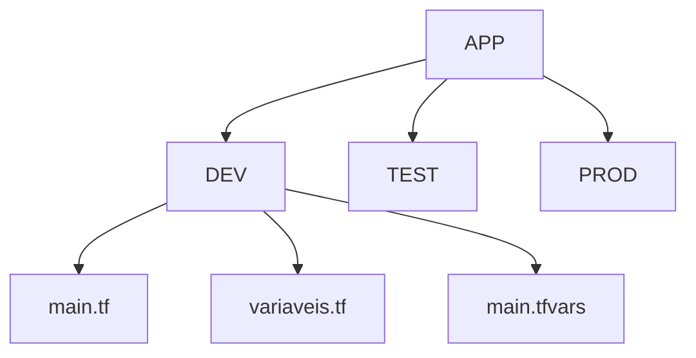
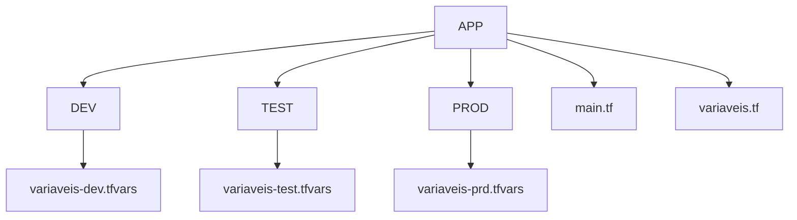

# Terraform em Pastas

Uso em ambientes pequenos, ruim por que tem que duplicar o ambiente

Cada um deles tera um arquivo main.tf, variaveis.tf e main.tfvars.



Deve entrar em cada pasta e dar os comandos:
```sh
init
```
```sh
plan
```
```sh
apply
```

Ou Usar a estrutura com os arquivos main.tf, variaveis.tf externamente e variaveis-aaa.tfvars internamente.




`$ terraform plan --var-file="tfvars/prod/variaveis.tfvars"`